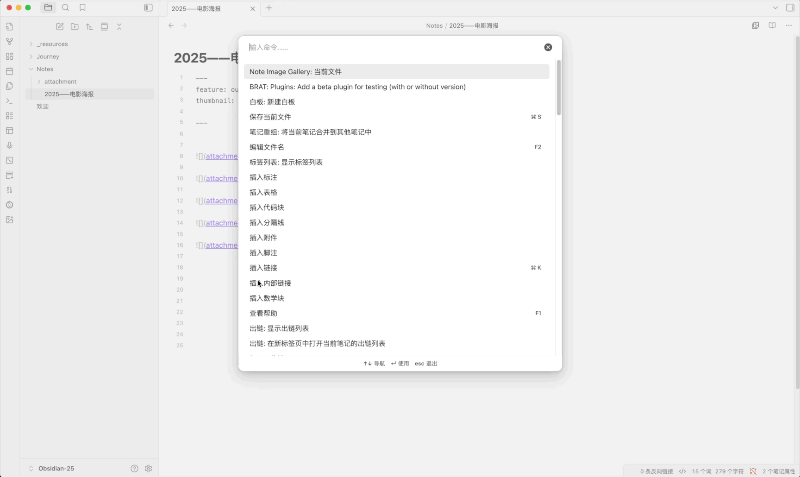

# Note Image Gallery

<p align="center">
  <strong>A powerful Obsidian plugin that displays all images from your current note in a beautiful, interactive gallery view.</strong>
</p>

<p align="center">
  <a href="https://github.com/Lemon695/obsidian-note-image-gallery/releases"></a>
  <a href="https://github.com/Lemon695/obsidian-note-image-gallery/blob/main/LICENSE"></a>
</p>

<p align="center">
  <a href="README.md">English</a> | <a href="README_zh.md">简体中文</a>
</p>

---

## 🎬 Demo

### 1、Enable via Command Palette



### 2、Enable via Commander Plugin


---

## ✨ Features

- **📸 Gallery View**: Display all images from your note in an elegant waterfall/masonry layout
- **🖼️ Image Support**:
  - Local images (vault attachments)
  - Remote images (HTTP/HTTPS URLs)
  - Special handling for Weibo images (微博图片)
- **🎨 Interactive UI**:
  - Click any image to open lightbox view with navigation
  - Arrow keys for quick navigation
  - Zoom in/out with mouse wheel or keyboard
  - Context menu for copying and downloading images
- **🔍 Filter & Sort**:
  - Filter images by type (All / Local / Remote)
  - Sort by size or default order
- **⚡ Performance**:
  - Lazy loading for improved performance
  - Virtual scrolling for large image collections
  - Smart image queue with priority management
  - Concurrent loading with configurable limits
- **💾 Smart Caching**:
  - File-based caching system for remote images
  - Configurable cache size and expiration
  - LFU+LRU hybrid cache eviction algorithm
  - Automatic cache cleanup and management
- **🌍 Internationalization**:
  - Auto-detects Obsidian language settings
  - Full support for English and Chinese (Simplified)
  - Easy to extend for more languages
- **📱 Cross-Platform**: Works on desktop and mobile devices

---

## 📦 Installation

### From Obsidian Community Plugins (Recommended)

1. Open Obsidian Settings
2. Navigate to **Community Plugins** and disable Safe Mode
3. Click **Browse** and search for "Note Image Gallery"
4. Click **Install**, then **Enable**

### Manual Installation

1. Download the latest release from the [Releases page](https://github.com/Lemon695/obsidian-note-image-gallery/releases)
2. Extract the files to your vault's plugins folder: `<vault>/.obsidian/plugins/note-image-gallery/`
3. Reload Obsidian
4. Enable the plugin in Settings → Community Plugins

---

## 🚀 Usage

### Opening the Gallery

There are three ways to open the image gallery:

1. **Command Palette**: Press `Ctrl/Cmd + P` and search for "Open Current Note Image Gallery"
2. **Ribbon Icon**: Click the image gallery icon in the left sidebar
3. **Hotkey**: Assign a custom hotkey in Settings → Hotkeys

### Gallery Navigation

- **Click** any image to view it in full-screen lightbox mode
- **Arrow Keys** (← →) to navigate between images
- **Mouse Wheel** or **+/-** keys to zoom in/out
- **ESC** or click outside to close lightbox
- **Right-click** on any image for context menu options:
  - Copy image to clipboard
  - Download image

### Filtering and Sorting

- Use the **filter buttons** at the top to show:
  - All images
  - Local images only
  - Remote images only
- Use the **sort dropdown** to order images by:
  - Default order (as they appear in the note)
  - Size (large to small)
  - Size (small to large)

---

## ⚙️ Settings

Access plugin settings via Settings → Note Image Gallery

### Cache Settings

| Setting | Description                             | Default |
|---------|-----------------------------------------|---------|
| **Enable Image Cache** | Cache remote images to speed up loading | Enabled |
| **Cache Validity Period** | Maximum cache age in days (1-60)        | 7 days |
| **Maximum Cache Size** | Maximum cache size in MB (10-300)       | 100 MB |

### Cache Management

- **Refresh Cache Status**: Recalculate current cache size
- **Clear All Cache**: Delete all cached images

### Developer Settings

| Setting | Description | Default |
|---------|-------------|---------|
| **Debug Mode** | Enable detailed console logging | Disabled |

---

## 🎯 Performance Tips

1. **Enable Caching**: Keep image caching enabled for faster loading of remote images
2. **Adjust Cache Size**: Increase cache size if you work with many remote images
3. **Regular Cleanup**: Clear cache periodically if storage space is limited
4. **Image Optimization**: Use optimized image formats (WebP, JPEG) for better performance

---

## 🛠️ Development

### Building the Plugin

```bash
# Install dependencies
npm install

# Build for development (with watch mode)
npm run dev

# Build for production
npm run build

# Run TypeScript type checking
npm run build
```

### Project Structure

```
obsidian-note-image-gallery/
├── src/
│   ├── main.ts                 # Plugin entry point
│   ├── settings.ts              # Settings tab and configuration
│   ├── service/
│   │   ├── current-note-image-gallery-service.ts  # Main gallery service
│   │   ├── image-cache-service.ts                 # Cache management
│   │   ├── image-extractor-service.ts             # Extract images from markdown
│   │   └── obsidian-image-loader.ts               # Image loading utilities
│   └── utils/
│       ├── log-utils.ts         # Logging system
│       ├── retry-handler.ts     # Retry logic
│       └── resource-manager.ts  # Resource cleanup
├── styles.css                   # Plugin styles
└── manifest.json                # Plugin manifest
```

### Technologies Used

- **TypeScript**: Type-safe development
- **Obsidian API**: Plugin framework
- **CSS Grid**: Waterfall layout
- **IntersectionObserver**: Lazy loading
- **File System API**: Cache management

---

## 🤝 Contributing

Contributions are welcome! Here's how you can help:

1. **Report Bugs**: Open an issue with detailed reproduction steps
2. **Suggest Features**: Share your ideas in the issues section
3. **Submit Pull Requests**:
   - Fork the repository
   - Create a feature branch (`git checkout -b feature/amazing-feature`)
   - Commit your changes (`git commit -m 'Add amazing feature'`)
   - Push to the branch (`git push origin feature/amazing-feature`)
   - Open a Pull Request

### Development Guidelines

- Follow existing code style
- Add comments for complex logic
- Test on both desktop and mobile
- Update README for new features

---

## 📝 License

This project is licensed under the MIT License - see the [LICENSE](LICENSE) file for details.

---

## 🙏 Acknowledgments

- Thanks to the Obsidian team for the excellent plugin API
- Inspired by various image gallery plugins in the community
- Special thanks to all contributors and users

---

## 📧 Support

- **Issues**: [GitHub Issues](https://github.com/Lemon695/obsidian-note-image-gallery/issues)
- **Discussions**: [GitHub Discussions](https://github.com/Lemon695/obsidian-note-image-gallery/discussions)
- **Author**: [@Lemon695](https://github.com/Lemon695)

---

## 🔄 Changelog

See [RELEASES](https://github.com/Lemon695/obsidian-note-image-gallery/releases) for a list of changes in each version.

---

<p align="center">
  Made with ❤️ for the Obsidian community
</p>
